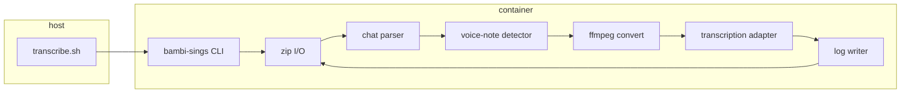

# Implementation plan: WhatsApp voice-note transcription

Record of intended build order for the utility described in [`prompts.md`](prompts.md). Anatomy assumptions live in [`README.md`](../README.md).

## Goals

| Goal | Acceptance |
| --- | --- |
| Readable chat log | In `_chat.txt`, every **included** voice note has human-readable transcription text at the same logical place in the timeline. |
| Fidelity | Original headers, senders, timestamps, attachment references, and non-audio messages unchanged except where transcription lines are inserted. |
| Reproducible run | One command (`./transcribe.sh`) via Docker Compose profile `tools`, no local Python required beyond Mise-managed tooling for development. |
| Quality bar | ≥85% line coverage on Python modules (pytest + coverage.py); flake8 clean in CI. |

**Non-goals (v1):** transcribing video audio tracks, diarization inside a single file, GUI, multi-export batching, incremental/cache API across runs (optional stretch).

## Current state

Phases 1–5 implemented: package scaffold, zip discovery/extraction, chat-log parsing, voice-note detection, ffmpeg conversion, `local` (`faster-whisper`) and `openai` (`gpt-4o-mini-transcribe` REST) transcriber adapters behind a shared `Transcriber` protocol, log rendering, Docker Compose `tools` profile, and CI (flake8 + pytest with an 85% coverage gate — currently ~86%). Sample input: a macOS-style export zip dropped into `exports/` (~186 `.opus` voice notes, iOS `_chat.txt`). `exports/` is gitignored; CI uses fixture zips under `tests/fixtures/`. Remaining: phase 7 hardening (retries/rate limits for the OpenAI provider, `--limit`-based cost estimation) and the optional transcript cache (stretch).

## Architecture



**Modules (Python package `bambi_sings`):**

| Module | Responsibility |
| --- | --- |
| `cli` | argparse entrypoint; paths; dry-run; verbosity. |
| `discovery` | Resolve exactly one `*.zip` in `exports/`; macOS name pattern `WhatsApp Chat - {title} ({n}).zip`. |
| `archive` | Extract to temp dir; rebuild zip to `output/{stem}_transcribed.zip`; copy non-log bytes verbatim. |
| `chat_log` | Find log file (`_chat.txt` or `WhatsApp Chat with *.txt`); normalize Unicode; parse messages per README schema. |
| `attachments` | Map `<attached: basename>` → path; classify `media_kind`; `is_voice_note()` heuristic. |
| `audio` | opus/aac/mp3 → mono WAV/MP3 for STT (ffmpeg subprocess). |
| `transcribe` | Provider interface + implementations (see below). |
| `render` | Insert transcription lines; preserve round-trip readability. |

## Voice-note detection

Treat as voice note when attachment resolves and **any** of:

- Basename contains `-AUDIO-` (iOS export convention in sample).
- Legacy `PTT-` prefix or `PTT` token in WhatsApp Android names.
- Extension in `{.opus, .ogg}` **and** not classified as video/document.

Skip: `audio omitted`, missing file on disk, zero-byte files.

## Transcription output format (text log)

Keep the **original message line** intact for audit. Insert **immediately after** one synthetic line per voice note:

```text
[8/21/26, 1:32:05 AM] Flo: [transcription via openai/gpt-4o-mini-transcribe] Hello, this is what was said.
```

Rules:

- Reuse the same `[timestamp]` and `sender` from the parsed header (normalized to export’s native format on write).
- Prefix `[transcription via {provider}/{model}]` — stable, grep-friendly, explicit for downstream AI.
- Body is plain transcription text; escape/no-op if empty (log warning, keep original only).
- Do not remove `‎<attached: …>` from the preceding original line.

Alternative considered: inline on one line — rejected because captions + attachment markers become hard to parse.

## Transcription service discovery

WhatsApp voice notes are **short, single-speaker, often noisy**; diarization is unnecessary. APIs must accept converted audio (from Opus).

| Option | Cost (indicative) | Quality | Fit |
| --- | --- | --- | --- |
| **OpenAI `gpt-4o-mini-transcribe`** (recommended default) | ~$0.003/min batch | Strong general English; improved over `whisper-1` | Simple REST; good price/quality for personal chat exports |
| OpenAI `whisper-1` | ~$0.006/min | Proven multilingual | Legacy; use only if mini unavailable |
| **Local `faster-whisper` (large-v3-turbo)** | Infra only | ~Whisper-class; GPU helps | Free/offline; ship as `TRANSCRIPTION_PROVIDER=local` for privacy |
| Deepgram Nova-3 | ~$0.004–0.008/min | Excellent English batch | Worth it if OpenAI quality on Opus is weak in testing |
| AssemblyAI Universal | ~$0.005/min | Strong features | Heavier SDK; overkill unless you need extras |

**Recommendation:** Implement a small **adapter interface** (`transcribe(path) -> TranscriptionResult`) with:

1. **`openai`** (default) — `gpt-4o-mini-transcribe`, API key from `OPENAI_API_KEY`.
2. **`local`** — `faster-whisper` in Docker image (CPU fallback, optional GPU compose override).

Run a **calibration pass** on ~10 diverse sample `.opus` files from export (21): compare providers for WER subjectively + cost. Sample export ≈186 notes; if mean duration 30s → ~93 minutes → **~$0.28** on mini-transcribe (order-of-magnitude).

**Free path:** Local Whisper in container — no per-minute fee; trade latency and image size (~2GB+ with models).

## CLI

```text
bambi-sings transcribe [--exports-dir exports] [--output-dir output] [--zip PATH] [--dry-run] [--provider openai|local]
```

- Default: auto-discover single zip in `exports/`.
- `--zip` overrides discovery (tests, CI).
- `--dry-run`: parse and list voice notes without STT or output zip.

## Docker & Compose

- **`containers/transcribe/Dockerfile`**: Python slim + ffmpeg; install package editable or wheel; optional CUDA stage later.
- **`docker-compose.yml`**: service `transcribe`, `profiles: [tools]`, volumes `./exports:/exports:ro`, `./output:/output`, env file `.env` for API keys.
- **`transcribe.sh`**: `docker compose --profile tools run --rm transcribe` (+ pass-through args).

No long-running daemon — ephemeral `run` only.

## Mise & local dev

`mise.toml` pins:

- Python 3.12+
- `uv` or `pip` workflow (prefer `uv` for speed)
- `docker` / `docker compose` (optional tools entry)

Tasks: `mise run lint`, `mise run test`, `mise run transcribe` (wraps compose).

## Testing & coverage (85%)

| Layer | Tests |
| --- | --- |
| Parser | Fixture `_chat.txt` snippets: iOS headers, multiline, `<attached:>`, omitted audio, edited suffix. |
| Voice filter | AUDIO vs VIDEO vs PHOTO basenames. |
| Render | Golden-file: input log + mock STT → expected output log. |
| Archive | Mini zip in fixtures: round-trip names, `_transcribed` suffix. |
| Discovery | Zero/multiple/single zip; `(N)` in filename. |
| Transcribe adapter | Mock HTTP (responses/respx); no live API in CI. |

Coverage omit: `if __name__`, thin `cli` wiring (or cover via invoke test).

## CI (`.github/workflows/ci.yml`)

On `push` to any branch:

1. Checkout, setup Python via mise or `actions/setup-python` matching `mise.toml`.
2. `pip install -e ".[dev]"`.
3. `flake8 bambi_sings tests`.
4. `pytest --cov=bambi_sings --cov-fail-under=85`.

No secrets; no integration tests hitting OpenAI.

## Implementation phases

| Phase | Deliverable | Est. |
| --- | --- | --- |
| **1. Scaffold** | `pyproject.toml`, package layout, flake8, pytest, coverage gate, empty CI | 0.5d |
| **2. Parse & classify** | Read zip, parse log, list voice notes (`--dry-run`) | 1d |
| **3. Render (mock STT)** | Insert placeholder transcription lines; write zip | 0.5d |
| **4. Audio + OpenAI** | ffmpeg + OpenAI adapter; env config | 1d |
| **5. Docker + script** | Compose profile `tools`, `transcribe.sh`, README usage | 0.5d |
| **6. Local provider** | faster-whisper optional; document GPU | 1d |
| **7. Hardening** | Error handling, rate limits/retries, progress logging, README cost notes | 0.5d |

**Total:** ~5 days focused work.

## Risks & mitigations

| Risk | Mitigation |
| --- | --- |
| Locale/Android format not in sample | Parser pluggable regex; add Android fixture when available |
| API cost on large exports | `--dry-run` count + estimated minutes; optional `--limit N` for dev |
| Opus incompatibility | ffmpeg normalize to 16 kHz WAV before STT |
| Rate limits | Exponential backoff; sequential or small pool (5) |
| PII in cloud STT | Document local provider; `.env` never committed |

## Open decisions (confirm before phase 4)

1. **Provider default** — implemented as `local` (`faster-whisper`), not OpenAI. No calibration pass has been run yet to confirm mini-transcribe quality/cost on the sample export, and defaulting to a free, offline provider avoids surprise API spend; `--provider openai` (needs `OPENAI_API_KEY`) is available and can become the default once calibrated.
2. **Failed transcription** — implemented: failed line (`[transcription failed: …]`) for visibility, per `render.py`.
3. **Caching** — not implemented; still a stretch goal.

## README updates (after build)

- Point input at zip in `exports/` (not only unpacked).
- Document `./transcribe.sh`, env vars, output naming `*_transcribed.zip`.
- Link to this plan and transcription provider notes.
